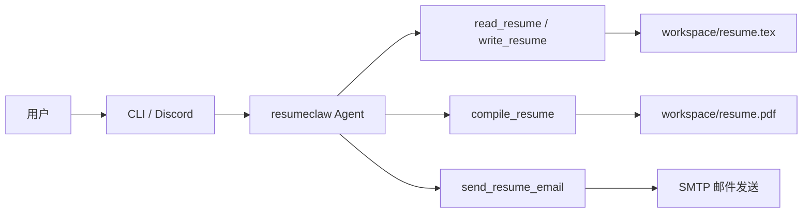

# resumeclaw


**resumeclaw** 是一个面向 **LaTeX 简历** 场景的 Rust AI Agent。它支持通过 **CLI** 或 **Discord Bot** 与 Agent 对话，让它读取、改写并编译简历，输出 PDF，必要时还可以通过 SMTP 发送到邮箱。

如果你想快速搭建一个支持 **AI 简历优化、LaTeX 简历编辑、PDF 编译、邮件发送** 的本地或在线工作流，resumeclaw 可以直接作为起点。

## 目录

- [快速开始 (Quick Start)](#快速开始-quick-start)
- [核心功能 (Features)](#核心功能-features)
- [安装步骤 (Installation)](#安装步骤-installation)
- [使用示例 (Usage)](#使用示例-usage)
- [配置说明 (Configuration)](#配置说明-configuration)
- [测试](#测试)
- [贡献指南 (Contributing)](#贡献指南-contributing)
- [许可证 (License)](#许可证-license)

## 快速开始 (Quick Start)

下面这组命令适合第一次体验项目，默认会进入**零配置开发模式**：使用内置模板、mock LLM 和 CLI 调试界面。

### 1 分钟跑起来

```bash
git clone https://github.com/Dragonchu/resumeclaw.git
cd resumeclaw
cargo run
```

启动后可以直接在 CLI 输入自然语言，例如：

```text
请先读取我的简历，并给出三条优化建议
```

如果未设置 `LLM_PROVIDER`，程序会自动：

- 启用内置 `mock` provider
- 使用 [`templates/default/`](./templates/default/) 中的默认模板
- 读取 [`dev/mock-llm-script.example.json`](./dev/mock-llm-script.example.json) 作为示例脚本
- 进入 CLI 调试模式，方便本地验证工具调用流程

## 核心功能 (Features)

- **多渠道交互**：支持本地 CLI 与 Discord Bot。
- **多 LLM 后端**：支持 DeepSeek、OpenAI、Anthropic、Ollama、Groq、Together，以及自定义 OpenAI 兼容端点。
- **简历工具链闭环**：内置 `read_resume`、`write_resume`、`compile_resume`、`send_resume_email` 等工具。
- **自动编译 PDF**：修改 LaTeX 简历后可直接用 `tectonic` 编译出 `resume.pdf`。
- **SMTP 邮件发送**：支持把当前 PDF 作为附件发送给允许的收件人。
- **独立工作区**：简历源文件、模板资源和编译产物写入工作区，不污染仓库模板目录。
- **零配置开发模式**：未配置真实 LLM 时也能直接体验完整流程。
- **代理友好**：同时支持原生 HTTP 代理和 `proxychains` 全局代理。

## 安装步骤 (Installation)

### 环境要求

- Rust toolchain（建议安装最新稳定版）
- `cargo`
- [Tectonic](https://tectonic-typesetting.github.io/)（用于编译 LaTeX 为 PDF）

### 安装依赖

#### macOS

```bash
brew install tectonic
rustup toolchain install stable
```

#### Ubuntu / Debian

```bash
sudo apt update
sudo apt install -y tectonic
curl https://sh.rustup.rs -sSf | sh
```

### 获取源码并运行

```bash
git clone https://github.com/Dragonchu/resumeclaw.git
cd resumeclaw
cargo run
```

> 如果你已经准备好了自己的模板目录，可以额外设置 `RESUME_TEMPLATE_DIR=/absolute/path/to/template`。

## 使用示例 (Usage)

### 典型工作流



### CLI 示例

```text
$ cargo run
> 请先读取我的简历
Agent -> 调用 read_resume
Agent -> 返回当前简历内容并提出修改建议
> /write_resume
...多行编辑 LaTeX 内容...
/end
Agent -> 调用 compile_resume
Agent -> 输出并打开/发送最新 resume.pdf
```

### CLI 调试命令

开发模式下，CLI 支持直接调用工具，适合快速验证：

- `/list`：列出当前 Agent 已注册的全部工具
- `/read_resume`：直接执行无参工具
- `/write_resume {"content":"...完整 tex 内容..."}`：用 JSON 参数调用工具
- `/write_resume`：进入多行输入模式，最后用 `/end` 提交、`/cancel` 取消

### 使用真实 LLM Provider

```bash
export LLM_PROVIDER=deepseek
export LLM_MODEL=deepseek-chat
export DEEPSEEK_API_KEY=sk-xxx
cargo run
```

### 使用 mock 脚本做本地冒烟测试

```bash
export LLM_PROVIDER=mock
export LLM_MODEL=mock-local
export MOCK_LLM_SCRIPT_PATH=/absolute/path/to/mock-llm.json
export RESUME_TEMPLATE_DIR=/absolute/path/to/your/template
export WORKSPACE_DIR=/absolute/path/to/your/workspace
cargo run
```

## 配置说明 (Configuration)

### 常用环境变量

| 变量 | 说明 |
| --- | --- |
| `LLM_PROVIDER` | LLM 提供方：`deepseek` / `openai` / `anthropic` / `ollama` / `groq` / `together` / `custom` / `mock` |
| `LLM_MODEL` | 模型名称 |
| `DEEPSEEK_API_KEY` 等 | 对应 Provider 的 API Key |
| `DISCORD_BOT_TOKEN` | Discord 机器人 Token；不配置则仅启用 CLI |
| `RESUME_TEMPLATE_DIR` | 外部模板目录；不配置时使用仓库内置模板 |
| `RESUME_TEMPLATE` | 启动时使用的模板文件名；只允许文件名，不允许路径分隔符 |
| `WORKSPACE_DIR` | 工作区目录；不设置时使用平台标准数据目录 |
| `LLM_BASE_URL` | 自定义 OpenAI 兼容端点地址（`LLM_PROVIDER=custom` 时使用） |
| `LLM_API_KEY` | 自定义端点的 API Key |
| `SMTP_HOST` | SMTP 服务器地址 |
| `SMTP_PORT` | SMTP 端口；不同安全模式下有默认值 |
| `SMTP_FROM` | 发件邮箱 |
| `SMTP_FROM_NAME` | 发件人显示名 |
| `SMTP_USERNAME` / `SMTP_PASSWORD` | SMTP 登录凭据 |
| `SMTP_SECURITY` | `starttls` / `tls`（也接受 `ssl`）/ `plain` |
| `SMTP_ALLOWED_RECIPIENTS` | 允许发送的收件人白名单，逗号分隔 |
| `PROXY_MODE` | 代理模式；配合 `proxychains` 使用时可设为 `external` |

### `.env` 示例

```bash
# LLM 配置
LLM_PROVIDER=deepseek
LLM_MODEL=deepseek-chat
DEEPSEEK_API_KEY=sk-xxx

# Discord（可选）
DISCORD_BOT_TOKEN=xxx

# 模板与工作区（可选）
RESUME_TEMPLATE_DIR=../resume
RESUME_TEMPLATE=resume-zh_CN.tex
WORKSPACE_DIR=

# 自定义 LLM 端点（可选）
LLM_BASE_URL=https://your-endpoint.com
LLM_API_KEY=xxx

# SMTP 邮件发送（可选）
SMTP_HOST=smtp.example.com
SMTP_PORT=587
SMTP_FROM=bot@example.com
SMTP_FROM_NAME=resumeclaw
SMTP_USERNAME=bot@example.com
SMTP_PASSWORD=xxx
SMTP_SECURITY=starttls
SMTP_ALLOWED_RECIPIENTS=me@example.com,hr@example.com
```

### 工作区默认位置

| 平台 | 默认路径 |
| --- | --- |
| macOS | `~/Library/Application Support/resumeclaw` |
| Linux | `$XDG_DATA_HOME/resumeclaw`（默认 `~/.local/share/resumeclaw`） |
| Fallback | `~/.resumeclaw` |

首次启动会自动把模板目录中的顶层支持文件（如 `.cls`、`.sty`、图片资源等）和 `fonts/` 目录同步到工作区，并生成 `resume.tex`。后续再次启动时，支持资源会按模板内容更新，但已存在的 `resume.tex` 会保留。

### 代理配置

#### 方式一：原生 HTTP 代理（仅 LLM API 走代理）

```bash
export https_proxy=http://127.0.0.1:1087
cargo run
```

#### 方式二：`proxychains` 全局代理（推荐）

```bash
unset http_proxy https_proxy HTTP_PROXY HTTPS_PROXY
export PROXY_MODE=external
proxychains4 cargo run
```

`PROXY_MODE=external` 会清理残留代理环境变量，并让 `proxychains` 在 TCP 层统一接管网络连接，适合同时代理 Discord 与 LLM 请求。

## 测试

项目当前使用 Cargo 原生命令进行验证：

```bash
cargo test
```

如需只运行本地 CLI 集成测试：

```bash
cargo test --test local_integration
```

## 贡献指南 (Contributing)

欢迎通过 Issue、讨论区或 Pull Request 参与项目改进。推荐流程如下：

1. Fork 本仓库并创建功能分支
2. 完成代码或文档修改
3. 运行 `cargo test` 确认没有引入回归
4. 在 PR 中说明变更动机、范围和验证方式

如果你想贡献新的简历模板、CLI/Discord 演示截图、mock 脚本、使用案例或文档优化，也同样欢迎。

## 许可证 (License)

本项目采用 **GNU General Public License v3.0**（GPLv3）开源。详情请见仓库根目录下的 [LICENSE](./LICENSE) 文件。
