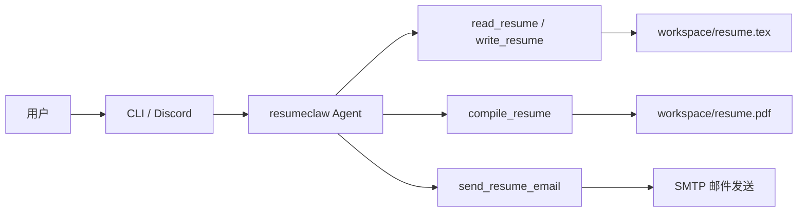

# resumeclaw


**resumeclaw** 是一个面向 **LaTeX 简历** 场景的 Rust AI Agent：你可以通过 **CLI** 或 **Discord Bot** 与它对话，让它读取、改写并编译简历，最终生成 PDF，或直接把 PDF 发送到邮箱。  
如果你正在寻找一个支持 **AI 简历优化、LaTeX 简历编辑、Discord/CLI 多渠道交互** 的项目，resumeclaw 可以帮助你快速搭建本地或在线的简历工作流。

> 建议同时完善 GitHub 仓库右侧 **About** 与 **Topics**，例如补充 `rust`、`latex`、`resume`、`discord-bot`、`ai-agent` 等关键词，以提升检索与推荐效果。

## 目录

- [核心特性](#核心特性)
- [工作流概览](#工作流概览)
- [快速开始](#快速开始)
  - [1. 前置依赖](#1-前置依赖)
  - [2. 环境变量](#2-环境变量)
  - [3. 启动项目](#3-启动项目)
  - [4. CLI 直接调试工具](#4-cli-直接调试工具)
- [演示](#演示)
- [模板与工作区](#模板与工作区)
- [测试](#测试)
- [代理配置](#代理配置)
- [Roadmap](#roadmap)
- [Contributing](#contributing)
- [致谢](#致谢)
- [License](#license)

## 核心特性

- **多渠道接入**：支持 Discord 机器人与本地 CLI 两种交互方式。
- **多 LLM 后端**：支持 DeepSeek、OpenAI、Anthropic、Ollama、Groq、Together，以及自定义 OpenAI 兼容端点。
- **Tool Calling 驱动**：通过 `read_resume`、`write_resume`、`compile_resume`、`send_resume_email` 等工具完成简历读写、编译和发送。
- **自动 PDF 编译**：修改 LaTeX 简历后自动调用 `tectonic` 生成 PDF。
- **邮件投递**：支持通过 SMTP 把当前 `resume.pdf` 作为附件发给指定收件人。
- **独立工作区**：编辑文件、模板资源和编译产物写入平台标准数据目录，不污染仓库模板。
- **零配置开发模式**：未设置 `LLM_PROVIDER` 时，会自动启用仓库内置的 mock provider、示例模板与 CLI 调试模式。
- **代理友好**：同时支持原生 HTTP 代理和 `proxychains` 全局代理。

## 工作流概览



项目的默认入口是对话式简历编辑：用户发送需求，Agent 决定是否读取当前简历、写入新的 LaTeX 内容、编译 PDF，必要时再通过邮件发送结果。

## 快速开始

### 1. 前置依赖

- Rust toolchain（`cargo`）
- Tectonic（macOS: `brew install tectonic`，Linux: `apt install tectonic`）
- （可选）外部简历模板目录，用于覆盖项目内置模板

### 2. 环境变量

创建 `.env` 文件或通过 shell 导出环境变量：

```bash
# 可选 - LLM 配置
LLM_PROVIDER=deepseek          # deepseek / openai / anthropic / ollama / groq / together / custom
LLM_MODEL=deepseek-chat        # 模型名
DEEPSEEK_API_KEY=sk-xxx        # 对应 provider 的 API Key

# 可选 - Discord（不配则仅启用 CLI）
DISCORD_BOT_TOKEN=xxx

# 可选 - 路径
RESUME_TEMPLATE_DIR=../resume     # 外部模板目录；不设置时使用仓库内置模板
RESUME_TEMPLATE=resume-zh_CN.tex  # 初始模板文件名，仅允许文件名，不允许包含路径分隔符
WORKSPACE_DIR=                    # 工作区目录，默认为平台标准路径

# 可选 - 自定义 LLM 端点（LLM_PROVIDER=custom 时使用）
LLM_BASE_URL=https://your-endpoint.com
LLM_API_KEY=xxx

# 可选 - SMTP 邮件发送（send_resume_email tool 使用）
SMTP_HOST=smtp.example.com
SMTP_PORT=587
SMTP_FROM=bot@example.com
SMTP_FROM_NAME=resumeclaw
SMTP_USERNAME=bot@example.com
SMTP_PASSWORD=xxx
SMTP_SECURITY=starttls            # starttls / tls(也接受 ssl) / plain
SMTP_ALLOWED_RECIPIENTS=me@example.com,hr@example.com
```

如果你在开发环境里**没有配置 `LLM_PROVIDER`**，程序会自动进入零配置开发模式：

- 自动启用仓库内置的 `mock` provider
- 自动读取 [`templates/default/`](./templates/default/) 完整模板作为示例简历
- 自动读取 [`dev/mock-llm-script.example.json`](./dev/mock-llm-script.example.json) 作为示例对话脚本
- 默认启用 CLI + Agent 的实时调试模式

### 3. 启动项目

```bash
cargo run
```

启动后可在 CLI 直接输入消息，或通过 Discord 与 Bot 对话。若未提供任何 LLM / Channel 配置，则会自动进入上述零配置开发模式。

### 4. CLI 直接调试工具

开发模式下，CLI 支持直接调用工具：

- `/list`：展示当前 Agent 已注册的全部工具
- `/read_resume`：直接执行无参工具
- `/write_resume {"content":"...完整 tex 内容..."}`：直接传 JSON 参数调用工具
- 对于只有 `content` 字符串参数的工具，也可以直接写成 `/write_resume ...`
- 单独输入 `/write_resume` 可进入多行模式，最后用 `/end` 提交，或用 `/cancel` 取消

## 演示

### CLI 示例

```text
$ cargo run
> 请先读取我的简历
Agent -> 调用 read_resume
Agent -> 返回当前简历内容并提出修改建议
> /write_resume
...多行编辑 LaTeX 内容...
/end
Agent -> 调用 compile_resume
Agent -> 输出并打开/发送最新 resume.pdf
```

### Demo 资源建议

当前仓库暂未包含 GIF 或截图素材；如果你希望项目页更具吸引力，建议后续补充：

1. CLI 对话录屏 GIF
2. Discord Bot 实际交互截图
3. 编译前后简历 PDF 对比图

## 模板与工作区

工作区默认用于存放编辑中的 `.tex` 文件和编译产物：

| 平台 | 默认路径 |
| --- | --- |
| macOS | `~/Library/Application Support/resumeclaw` |
| Linux | `$XDG_DATA_HOME/resumeclaw`（默认 `~/.local/share/resumeclaw`） |
| Fallback | `~/.resumeclaw` |

首次启动会自动从模板目录同步顶层支持文件（如 `.cls`、`.sty`、图片资源等）以及 `fonts/` 目录，并在工作区生成 `resume.tex`。后续再次启动时，这些支持资源会按模板目录内容覆盖更新，而已存在的 `resume.tex` 仍会保留。

- 模板目录下任意 `.tex` 文件都会被视为可选模板。
- 默认优先使用内置英文模板，如需中文模板可设置 `RESUME_TEMPLATE=resume-zh_CN.tex`。
- 内置中文模板直接附带可再分发的 Fandol OpenType 字体文件，并优先从工作区内的 `fonts/` 目录加载。

如果你想了解模板和零配置开发模式的真实行为，可以直接参考：

- [`templates/default/`](./templates/default/)
- [`tests/local_integration.rs`](./tests/local_integration.rs)

## 测试

自动化验证使用 Cargo 原生命令：

```bash
cargo test
```

其中本地集成测试会使用 `LLM_PROVIDER=mock` 的脚本化方案，在不接入 Discord、也不调用真实大模型的情况下验证主流程：

```bash
cargo test --test local_integration
```

手动冒烟测试也可以通过 mock 脚本完成：

```bash
export LLM_PROVIDER=mock
export LLM_MODEL=mock-local
export MOCK_LLM_SCRIPT_PATH=/absolute/path/to/mock-llm.json
export RESUME_TEMPLATE_DIR=/absolute/path/to/your/template
export WORKSPACE_DIR=/absolute/path/to/your/workspace
cargo run
```

## 代理配置

### 方式一：原生 HTTP 代理（仅 LLM API 走代理）

```bash
export https_proxy=http://127.0.0.1:1087
cargo run
```

> 注意：Discord Gateway 使用 WebSocket，不走 HTTP 代理。如果需要代理 Discord 连接，请使用下方的 `proxychains` 方案。

### 方式二：proxychains 全局代理（推荐）

```bash
unset http_proxy https_proxy HTTP_PROXY HTTPS_PROXY
export PROXY_MODE=external
proxychains4 cargo run
```

`PROXY_MODE=external` 会：

1. 设置 `NO_PROXY=*` 禁用所有 HTTP 客户端（包括第三方库）的内置代理检测
2. 清除残留的代理环境变量
3. 让 proxychains 在 TCP 层统一处理所有网络连接

> **重要**：使用 proxychains 时必须先 `unset` 代理环境变量，否则会导致双重代理（`TunnelUnexpectedEof` 错误）。

## Roadmap

- [ ] 提问式简历编写（Agent 主动向用户提问收集信息）
- [ ] 根据 JD 自动微调简历
- [ ] 简历版本管理与对比
- [ ] 简历自动投递及进度追踪
- [ ] 多语言简历支持（中 / 英切换）
- [ ] 更多渠道接入（飞书、Telegram 等）
- [ ] 对话上下文记忆（多轮跨消息）

## Contributing

欢迎通过 Issue、讨论区或 Pull Request 参与项目改进。推荐流程：

1. Fork 并创建功能分支
2. 完成代码或文档修改
3. 运行 `cargo test` 确认无回归
4. 在 PR 中说明动机、变更范围与验证方式

如果你只是想贡献模板、截图、演示脚本或使用案例，也非常欢迎。

## 致谢

本项目受到以下开源项目的启发，在此表示感谢：

- [ironclaw](https://github.com/nearai/ironclaw) — Rust 实现的多渠道 AI Agent 框架，本项目的架构设计参考了其频道抽象和 LLM Provider 模式。
- [resume](https://github.com/billryan/resume) — 简洁优雅的 LaTeX 中英文简历模板，本项目内置默认模板的版式设计参考了该项目。

## License

本项目采用 **GNU General Public License v3.0**（GPLv3）开源，详见仓库根目录下的 [LICENSE](./LICENSE) 文件。
